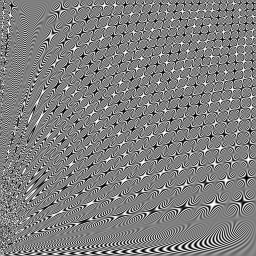

# Bitmap Image

BMP ranges from being a fairly simple format in some versions, to more complex with features like compression in others. This example shows the creation of a 512x512 grayscale image, with 256 color depth.

<center></center>

```javascript
const fs = require('fs');
const path = require('path');
const { Struct, RawString, U16LE, U32LE, U8s, SizeOf32LE } = require('construct-js');

const width = 512;
const height = 512;

const bmpFile = Struct('bmpFile');

const header = Struct('header')
  .field('magic', RawString('BM'))
  .field('size', SizeOf32LE(bmpFile))
  .field('reserved1', U16LE(0))
  .field('reserved2', U16LE(0))
  .field('startOffset', U32LE(0));

const dibHeader = Struct('dibHeader')
  .field('size', U32LE(40))
  .field('width', U32LE(width))
  .field('height', U32LE(height))
  .field('colorPlanes', U16LE(1))
  .field('bitsPerPixel', U16LE(8))
  .field('compression', U32LE(0))
  .field('compressedSize', U32LE(0))
  .field('xPixelsPerMeter', U32LE(0))
  .field('yPixelsPerMeter', U32LE(0))
  .field('totalColors', U32LE(0))
  .field('importantColors', U32LE(0));

// The color table consists of 256 grayscale values
const colorTableValues = Array.from({length: 256}).reduce(
  (acc, _, i) =>[...acc, i, i, i, 0],
  []
);
const colorTable = Struct('colorTable').field('entries', U8s(colorTableValues));

const pixels = Struct('pixels');

bmpFile
  .field('header', header)
  .field('dibHeader', dibHeader)
  .field('colorTable', colorTable)
  .field('pixels', pixels);

// Create a cool, fractaly wave pattern based on the x and y position of each pixel
const pixelData = Array.from({length: width*height}, (_, i) => {
  const x = (i % width) / width;
  const y = Math.floor(i / width) / height;
  const waveValue = (Math.sin(x**y * Math.PI * 2 * (i / 25)) + 1) / 2;
  const grayscaleValue = waveValue * 255;

  return grayscaleValue;
});

// Set the pixels in the structure
pixels.field('data', U8s(pixelData));

// Serialise the BMP to a buffer and write it to a file
const buf = bmpFile.toBuffer();
fs.writeFileSync(path.join(__dirname, 'bitmap-image.bmp'), buf);
```
